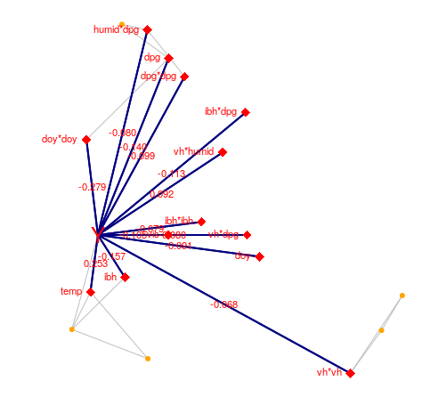
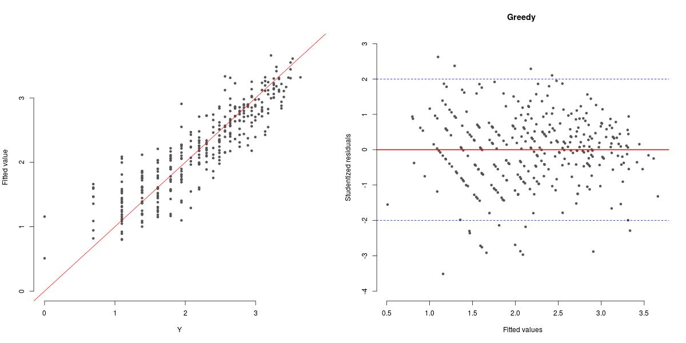
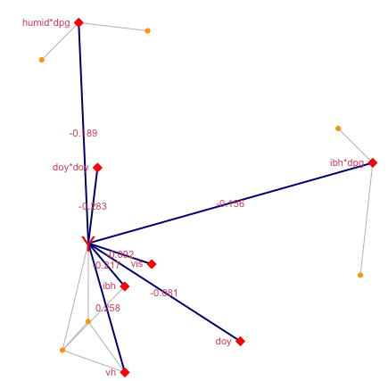
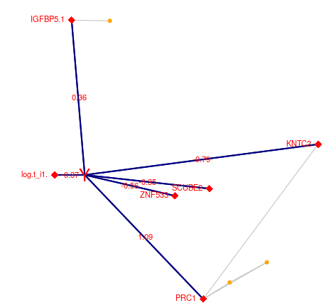
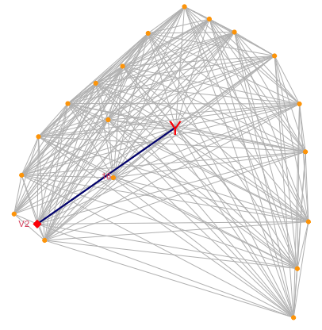
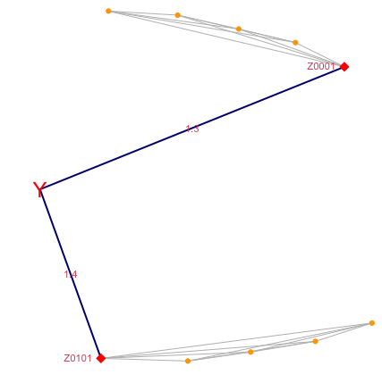

This vignette is based on the paper *"A Scalable Empirical Bayes Approach to Variable Selection in Generalized Linear Models"* (Bar, Booth & Wells, 2019).
It provides code and sample output for simulated data and case studies, and documents the mixed-effects extension (`fitSEMMSmixed()`) introduced in version 0.4.0 (Gaussian) and extended to Poisson and binomial responses in version 0.4.1.

## Set-Up

SEMMS is implemented in R and is available as a package from github, https://github.com/haimbar/SEMMS
<!--the following web-site:
https://haim-bar.uconn.edu/software/ -->

SEMMS requires R version 3.6.0 and up. All dependencies are installed automatically when you install SEMMS via `devtools`:

```
devtools::install_github("haimbar/SEMMS")
```

The dependencies are: `Rcpp`, `RcppArmadillo` (compile-time), `MASS`, `car`, `lme4`, and `edgefinder`. The last of these is a GitHub-only package; it is pulled in automatically via the `Remotes` field in SEMMS's `DESCRIPTION`, but can also be installed manually:

```
devtools::install_github("haimbar/edgefinder")
```
<!--download the latest version (currently SEMMS_0.1.5.tar.gz) and in the R console navigate to the directory where the file is saved, and run:

```
install.packages("SEMMS_0.1.5.tar.gz", repos=NULL)
```
-->

To create files which SEMMS can use, please read the documentation of the function readInputFile.

## Updates

- Version 0.4.1 extends `fitSEMMSmixed()` to **Poisson** and **binomial** responses using the proper IRLS (Penalised Quasi-Likelihood) working response of Breslow and Clayton (1993). See the [Mixed-Effects Extension](#mixed-effects-extension) section below for details.

- Version 0.4.0 adds `fitSEMMSmixed()`, an alternating coordinate-ascent extension that supports random intercepts, random slopes, or both, via the `lme4` package, for Gaussian responses. See the [Mixed-Effects Extension](#mixed-effects-extension) section below for details.

- Version 0.2.5 significantly improves computational performance via the Woodbury matrix identity and the matrix determinant lemma. The core C++ routines (`loglik` and `fit_gam`) no longer form N×N matrices: log-determinant computation is reduced from O(N³) to O(L³) where L is the number of currently-selected variables (typically L << N), and all quadratic forms and traces are computed in O(N·L) time. Pre-computing fixed quantities outside the EM loop further reduces redundant work. On a simulated dataset with N=500 and P=1,000 predictors, the speedup is approximately 38×.

- Version 0.2.0 uses the edgefinder function in order to find highly correlated pairs of predictors. Then, it forms clusters of predictors and picks the central variable from each cluster to be included in the fitting process. Any variable not assigned to a cluster is also included in the model fitting. The excluded variables are shown by the plotMDS function, if they end up begin highly correlated with a significant predictor. By default, initWithEdgeFinder is set to TRUE. To pick the initial set of predictors manually, set this argument to FALSE, and use the nnset argument.

## The Ozone data

The air-pollution data set analyzed in this case study was first introduced in 
(Breiman, L, and J Friedman, 1985), who illustrated the ACE procedure. It consists of daily measurements of ozone concentration levels in the Los Angeles basin, collected over 330 days in 1976.  There are eight meteorological explanatory variables, labeled x1,...,x8:
 
  - x1: (vh) Vandenburg height, % - the altitude at which the pressure is 500 millibars,
  - x2: (wind) the wind speed (mph),
  - x3: (hum) the humidity (%),
  - x4: (temp) the temperature (Fahrenheit),
  - x5: (ibh) the temperature inversion base height (feet),
  - x6: (dpg) the pressure gradient (mm Hg),
  - x7: (ibt) the inversion base temperature (Fahrenheit),
  - x8: (vis) the visibility (miles).
  
We refer to a more recent analysis in (Lee, Nelder, and Pawitan, 2006, subsection 2.4.4), which also uses x9, the day of the year (doy). Selecting a first-order linear regression model can be done easily by checking all 2<SUP>9</SUP>=512 possible models, but this strategy is not feasible when we wish to include second, or third order terms (with 2<SUP>54</SUP> and 2<SUP>219</SUP> possible models, respectively.) We consider models with first and second order terms, with a total of 54 putative predictors.  We standardize these predictors using the scale function in R.
We use SEMMS to fit a log-linear model in which it is assumed that log(Y) is normally distributed. The following code shows how to run the “greedy” version of SEMMS (**rnd=F** in the code below), and produce some plots (see Figure 1 and Figure 2 below).

```
library(SEMMS)
# The ozone data, adding second order terms
fn <- system.file("extdata", "ozone.txt", package = "SEMMS", mustWork = TRUE)
dataYXZ <- readInputFile(fn, ycol=2, skip=19, Zcols=3:11,
   addIntercept = TRUE, logTransform = 2, twoWay = TRUE)
nn <- 20    # initial guess for the number of non-nulls
rnd <- F
fittedSEMMS <- fitSEMMS(dataYXZ, mincor=0.75, nn=nn, minchange=1, initWithEdgeFinder=F,
                        distribution="N",verbose=T,rnd=rnd)
foundSEMMS <- sort(union(which(fittedSEMMS$gam.out$lockedOut != 0),
                         fittedSEMMS$gam.out$nn))
fittedGLM <- runLinearModel(dataYXZ,fittedSEMMS$gam.out$nn, "N")
print(summary(fittedGLM$mod))
plotMDS(dataYXZ, fittedSEMMS, fittedGLM, ttl="Ozone Data")
plotFit(fittedGLM)
```


{ width=50% }


{ width=80% }

The model with the variables depicted in Figure 1 fits well, as can be seen in Figure 2, and it explains 83.3% of the variability in the data. The adjusted R<SUP>2</SUP> is 82.5, and the AIC is 187 (Aikake, 1974), compared with 75% and 303, respectively, in (Lee et al., 2006)

Notes about the code:

1. In the readInputFile we used the option **twoWay=TRUE** to add all the second order terms.
2. **foundSEMMS** is a vector which contains all the selected variables and ones which are highly correlated with them (|r|>0.75 in this example.) 
3. **plotMDS** was used to generate a graphical representation of the selected variables and the response as a network in Figure 1, and **plotFit** was used to generate the diagnostics plots in Figure 2.
4. We get similar results if we do not log-transform the response, and use P (Poisson) instead of N (normal) in the distribution argument of **fitSEMMS**.
5. Note that **addIntercept = TRUE** means that the original data does not contain an intercept, so SEMMS should add it before running the algorithm. FALSE means that the data already contains an intercept, and there is no need to add it.
6. We used the option **initWithEdgeFinder=F**, which means that the algorithm did not use edgefinder to find highly correlated predictors. It used a simple threshold method. In general, setting **initWithEdgeFinder=T** is preferred, since it uses a method which allows to control the error rate when deciding which edges should be in the graph. When this argument is set to TRUE, the **mincor** argument is ignored.
7. We used the option **nn=20** to start the algorithm with 20 putative predictors. SEMMS uses a simple criterion based on one predictor at a time analysis but, the user may provide a specific set of predictors for the initial iteration.  For example, to use variables 9, 45, and 54 we can use the **nnset** parameter, as follows:
    
```
fittedSEMMS <- fitSEMMS(dataYXZ, mincor=0.75, nnset=c(9,45,54), minchange=1,
                        distribution="N",verbose=T,rnd=rnd)
```

One may also choose the initial set of variables using a different method, such as the lasso. The iterative nature of our Generalized Alternating Minimization (GAM) algorithm, it is guaranteed
to do at least as well as the method used to initialize it because it yields a non-increasing Kullback-Leibler divergence. For example, using the ncvreg package, with the MCP penalty, we can do:

```
cv <- cv.ncvreg(dataYXZ$Z, dataYXZ$Y,family="gaussian", penalty="MCP")
fit <- cv$fit
beta <- fit$beta[,cv$min]
nnset <- which(beta!=0)[-1] - 1
fittedSEMMS <- fitSEMMS(dataYXZ, mincor=0.75, nnset=nnset, minchange=1,
                        distribution="N",verbose=T,rnd=rnd)
```

This yields 16 variables in the nnset variable.

Finally, we show the results when SEMMS with the edgefinder option set to TRUE: 
```
fittedSEMMS <- fitSEMMS(dataYXZ, mincor=0.8, nn=15, minchange  = 1,
                        distribution="N",verbose=T,rnd=F)
fittedGLM <- runLinearModel(dataYXZ,fittedSEMMS$gam.out$nn, "N")
plotMDS(dataYXZ, fittedSEMMS, fittedGLM, ttl="Ozone data")
```

{ width=50% }

We can obtain an ANOVA table for the final model, as follows. 

```
regressionTable <- summary(fittedGLM$mod)$coefficients
zvars <- grep("Z\\d{4}",rownames(regressionTable),perl = T)
rownames(regressionTable)[zvars] <- dataYXZ$originalZnames[fittedSEMMS$gam.out$nn]
print(xtable(regressionTable), type="html")
```


|             | Estimate | Std. Error | t value | Pr(>\|t\|) |
|-------------|--------:|----------:|-------:|----------:|
| (Intercept) |    2.21 |      0.02 | 114.88 |      0.00 |
| vh          |    0.26 |      0.03 |   8.84 |      0.00 |
| ibh         |   -0.22 |      0.03 |  -8.25 |      0.00 |
| vis         |   -0.09 |      0.02 |  -4.09 |      0.00 |
| doy         |   -0.08 |      0.02 |  -3.65 |      0.00 |
| humid\*dpg  |   -0.19 |      0.02 |  -7.61 |      0.00 |
| ibh\*dpg    |   -0.16 |      0.02 |  -7.18 |      0.00 |
| doy\*doy    |   -0.28 |      0.02 | -12.52 |      0.00 |

The log(ozone) levels are a quadratic function of the day of the year. The maximum of this second degree polynomial with respect to doy corresponds approximately to June 20, very close to the spring solstice. This captures the seasonal effect, as it is well known that ozone levels are associated with the duration of daylight.


   

## The NKI70 data

The NKI70 data is available from the “penalized” package in R (Goeman, 2010). In (Bar, Booth, and Wells, 2019) we discuss how we used this data set to analyze which genes are associated with either death or recurrence of metastasis. Here, we show how to invoke SEMMS to perform the analysis, using the Poisson response, per (Whitehead, 1980).
The selected model is shown graphically in Figure 4.

```
fn <- system.file("extdata", "NKI70_t1.RData", package = "SEMMS", mustWork = TRUE)
dataYXZ <- readInputFile(file=fn, ycol=1, Zcols=2:73)
fittedSEMMS <- fitSEMMS(dataYXZ, mincor=0.8, nn=6, minchange  = 1,
                        distribution="P", verbose=T, rnd=F)
# Fit the linear model using the selected predictors
fittedGLM <- runLinearModel(dataYXZ,fittedSEMMS$gam.out$nn, "P")
plotMDS(dataYXZ, fittedSEMMS, fittedGLM, ttl="NKI70")

summary(fittedGLM$mod)
```

{ width=50% }

The estimated coefficients for the selected model are as follows:

|             | Estimate | Std. Error | z value | Pr(>\|z\|) |
|-------------|--------:|----------:|-------:|----------:|
| (Intercept) |   -2.81 |      0.40 |  -7.04 |      0.00 |
| log.t\_i1.  |   -0.37 |      0.09 |  -4.17 |      0.00 |
| SCUBE2      |   -0.35 |      0.27 |  -1.27 |      0.20 |
| KNTC2       |   -0.79 |      0.33 |  -2.41 |      0.02 |
| ZNF533      |   -0.56 |      0.36 |  -1.56 |      0.12 |
| IGFBP5.1    |    0.36 |      0.16 |   2.20 |      0.03 |
| PRC1        |    1.09 |      0.38 |   2.91 |      0.00 |
   

SEMMS allows the user to 'lock-in' variables. That is, to choose which variables *must*
be included in the model. For example, if we want to include log.t_i1. and Age in the model,
we invoke SEMMS by using the **Xcols** and **Zcols** parameters, like this:

```
dataYXZ <- readInputFile(file=fn, ycol=1, Xcols=2:3, Zcols=4:73)
fittedSEMMS <- fitSEMMS(dataYXZ, mincor=0.8, nn=6, minchange  = 1,
                        distribution="P", verbose=T, rnd=F)
fittedGLM <- runLinearModel(dataYXZ,fittedSEMMS$gam.out$nn, "P")
plotMDS(dataYXZ, fittedSEMMS, fittedGLM, ttl="NKI70")

summary(fittedGLM$mod)
```

The plotMDS function does not show locked-in predictors, but they are estimated by runLinearModel.

|             | Estimate | Std. Error | z value | Pr(>\|z\|) |
|-------------|--------:|----------:|-------:|----------:|
| (Intercept) |   -2.77 |      0.40 |  -7.00 |      0.00 |
| log.t\_i1.  |   -0.38 |      0.09 |  -4.28 |      0.00 |
| Age         |   -0.18 |      0.19 |  -0.95 |      0.34 |
| ZNF533      |   -0.72 |      0.39 |  -1.85 |      0.06 |
| COL4A2      |    0.45 |      0.20 |   2.29 |      0.02 |
| IGFBP5.1    |    0.36 |      0.17 |   2.17 |      0.03 |
| PRC1        |    0.55 |      0.28 |   1.96 |      0.05 |
   
## Simulated Data – AR(1)

The following example consists of 1,000 predictors, of which 20 are significant and are highly correlated. The model was denoted by N5 in (Bar, Booth, and Wells, 2019).
 where the error terms are i.i.d. from a standard normal distribution, and Z1,...,Z20 are drawn from a multivariate normal distribution with an autoregressive (AR1) structure, with $\rho=0.95$. In this simulation, N=100 and in our simulations we show that the median number of true positives obtained by SEMMS is 20, and the median number of false positives is 0.
The code for fitting the mixture model to this data via SEMMS is given here. Note that the input file may be a text file (e.g., comma or tab separated) or it can be an RData file which was created previously with the readInputFile function.

```
fn <- system.file("extdata", "AR1SIM.RData", package = "SEMMS", mustWork = TRUE)
dataYXZ <- readInputFile(fn, ycol=1, Zcols=2:1001)
fittedSEMMS <- fitSEMMS(dataYXZ, mincor=0.8, nn=15, minchange  = 1,
                        distribution="N",verbose=T,rnd=F)
# Fit the linear model using the selected predictors
fittedGLM <- runLinearModel(dataYXZ,fittedSEMMS$gam.out$nn, "N")
plotMDS(dataYXZ, fittedSEMMS, fittedGLM, ttl="AR1 simulation")
```
In this case we used edgefinder to detect highly correlated pairs, and we find all the true predictors, and no false positives. In this example, if we do not use edgefinder, and rely on the **mincor=0.8** seting, SEMMS finds one false positive (v211) and 20 true positives. Figure 5 shows a graphical representation of the selected model. The red diamonds represent the variables which were selected by SEMMS, and the gold circles correspond to variables which are highly correlated with a selected predictor. This diagram, obtained from the plotMDS function in the SEMMS package clearly shows the AR(1) structure among the significant predictors.


{ width=50% }


## Simulated Data – Binary Response AR(1)

The data set SimBin provided with the package contains a simulated dataset
according to simulation B2 in (Bar, Booth, and Wells, 2019), with 1000 predictors
of which 10 are associated with a *binary* response. 
The true predictors consist of two set of variables (Z1-Z5 and Z101-Z105), each one having 
an autoregressive structure, AR(1), with rho=0.95.

```
fn <- system.file("extdata", "SimBin.RData", package = "SEMMS", mustWork = TRUE)
dataYXZ <- readInputFile(fn, ycol=1, Zcols=2:1001)
fittedSEMMS <- fitSEMMS(dataYXZ, mincor=0.7, nn=5, minchange  = 1,
    distribution="B", verbose=T, rnd=F)
fittedGLM <- runLinearModel(dataYXZ,fittedSEMMS$gam.out$nn, "B")
plotMDS(dataYXZ, fittedSEMMS, fittedGLM, ttl="Simulated Binomial (AR1)")
```

{ width=50% }


## Mixed-Effects Extension {#mixed-effects-extension}

Version 0.4.0 introduces `fitSEMMSmixed()`, which extends SEMMS to settings
where observations are grouped (e.g., repeated measures, longitudinal data)
and the response depends on subject-level random effects in addition to
high-dimensional fixed effects.  Version 0.4.1 extends support to **Poisson**
and **binomial** responses.

### How it works

The algorithm alternates between two steps until convergence:

1. **Fixed-effects step.** Run `fitSEMMS()` on the RE-adjusted IRLS working
   response $W^*_{ij}$, treating it as Gaussian.  For Gaussian data this is
   simply $Y - \hat{u}$.  For Poisson and binomial data it is the
   Penalised Quasi-Likelihood (PQL) working response (Breslow & Clayton, 1993)
   with the random-effect contribution removed:

   $$W^*_{ij} = \hat\eta^\text{fixed}_{ij} + (Y_{ij} - \hat\mu_{ij})\,
     \left.\frac{\partial\eta}{\partial\mu}\right|_{\hat\mu_{ij}}$$

   where $\hat\eta^\text{fixed}_{ij} = \texttt{predict(glmer, re.form=NA)}$
   and $\hat\mu_{ij} = \texttt{fitted(glmer)}$.  Because $\hat\mu_{ij}$ is
   a continuous fitted value, $W^*_{ij}$ is continuous for all three families.

2. **Random-effects step.** Refit an `lmer`/`glmer` model conditional on the
   currently selected fixed effects (ML/Laplace); extract the updated working
   response for the next iteration.

The loop is warm-started with a null `lmer`/`glmer` (intercept-only fixed
part) and stops when $\max|\Delta\hat{u}| <$ `outer_tol` (default $10^{-3}$).
A final REML `lmer` (Gaussian) or Laplace `glmer` (Poisson/binomial) with the
selected predictors is returned as the reported model.
In practice the loop converges in 2–5 outer iterations.

### Data preparation

`readInputFile()` accepts two new optional arguments for the mixed-model
workflow:

- `group_col` – column index of the grouping variable (subject ID) used as the
  random-intercept factor.
- `random_slope_col` – column index of the continuous variable (e.g. time)
  used as a random slope.  Required when `random_slope = TRUE`.

### Example: Gaussian simulated longitudinal data

The package ships with a small simulated dataset
(`sim_mixed_N200_P100_k5.RData`): $N = 200$ observations from 20 subjects
over 10 time points, with $K = 100$ candidate predictors of which only 5 are
truly associated with the response.

```r
library(SEMMS)

fn  <- system.file("extdata", "sim_mixed_N200_P100_k5.RData",
                   package = "SEMMS", mustWork = TRUE)

# group_col = 2 (subject), random_slope_col = 3 (time)
dat <- readInputFile(fn, ycol = 1, Zcols = 4:103,
                     group_col = 2, random_slope_col = 3)

# Fit with both random intercept and random slope
fit <- fitSEMMSmixed(dat,
                     random_intercept = TRUE,
                     random_slope     = TRUE,
                     nn = 5, mincor = 0.7,
                     initWithEdgeFinder = FALSE,
                     verbose = TRUE)

# Selected variables (should recover columns 1-5)
cat("Selected:", fit$gam.out$nn, "\n")
cat("Converged:", fit$converged, "in", fit$outer_iter, "iteration(s)\n")

# Inspect the final REML lmer
summary(fit$lmer_fit)
```

To fit only a random intercept (no random slope), use:

```r
fit_ri <- fitSEMMSmixed(dat, random_intercept = TRUE, random_slope = FALSE,
                        nn = 5, mincor = 0.7, initWithEdgeFinder = FALSE)
```

### Example: non-Gaussian responses (Poisson and binomial)

For Poisson or binomial longitudinal data, pass `distribution = "P"` or
`distribution = "B"`.  The function automatically uses `glmer()` for the
random-effects step and the proper IRLS working response for the
fixed-effects step.

```r
# --- Poisson mixed model ---
# Assume dat_pois was created with readInputFile(..., group_col = 2,
#   random_slope_col = 3) for a Poisson-distributed count response.

fit_pois <- fitSEMMSmixed(dat_pois,
                           distribution     = "P",
                           random_intercept = TRUE,
                           random_slope     = TRUE,
                           nn = 5, mincor = 0.7,
                           initWithEdgeFinder = FALSE)

cat("Selected:", fit_pois$gam.out$nn, "\n")
summary(fit_pois$lmer_fit)   # glmer Poisson fit

# --- Binomial (binary) mixed model ---
# Assume dat_bin was created with readInputFile(..., group_col = 2)
# for a 0/1 binary response.  Only a random intercept is used here.

fit_bin <- fitSEMMSmixed(dat_bin,
                          distribution     = "B",
                          random_intercept = TRUE,
                          random_slope     = FALSE,
                          nn = 5, mincor = 0.7,
                          initWithEdgeFinder = FALSE)

cat("Selected:", fit_bin$gam.out$nn, "\n")
summary(fit_bin$lmer_fit)    # glmer binomial fit
```

The `distribution` argument accepts `"N"` (Gaussian, default), `"P"`
(Poisson, log link), or `"B"` (binomial, logit link).  The random-effects
structure is specified independently via `random_intercept` and
`random_slope` regardless of the chosen family.

### Examining and plotting the results

After fitting, you can use the same diagnostic functions as for plain SEMMS.
`runMixedModel()` refits the final REML model for a given set of predictors
and returns the `lmer` object together with AIC and VIF values:

```r
mm <- runMixedModel(dat, fit$gam.out$nn, fit$re_term)
summary(mm$mod)

# Diagnostic plots on the RE-adjusted response
dat_adj   <- dat
dat_adj$Y <- dat$Y - fit$re_offset
glm_fit   <- runLinearModel(dat_adj, fit$gam.out$nn, "N")
plotFit(glm_fit)
plotMDS(dat, fit, runLinearModel(dat, fit$gam.out$nn, "N"))
```

### Choosing the random-effects structure

| Scenario | `random_intercept` | `random_slope` | lme4 term |
|---|---|---|---|
| Subjects differ in baseline only | `TRUE` | `FALSE` | `(1 \| subject)` |
| Subjects differ in trend only | `FALSE` | `TRUE` | `(0 + time \| subject)` |
| Subjects differ in both (recommended) | `TRUE` | `TRUE` | `(1 + time \| subject)` |

When in doubt, include both; the REML fit will estimate near-zero variance
components if they are not supported by the data.

## References

Akaike, Hirotugu. 1974. "A new look at the statistical model identification." IEEE Transactions on Automatic Control 19 (6): 716-723.

Bar, Haim, James G. Booth, and Martin T. Wells (2019), Journal of Computational and Graphical Statistics, DOI: 10.1080/10618600.2019.1706542

Breslow, N. E. and Clayton, D. G. (1993). Approximate inference in generalized linear mixed models. *Journal of the American Statistical Association*, 88(421), 9–25.

Breiman, L, and J Friedman. 1985. "Estimating Optimal Transformations for Multiple Regression and Correlation." Technometrics 80: 580-598.

Goeman, J J. 2010. "L1 penalized estimation in the Cox proportional hazards model." no. 1. 14.
Hastie, T, and R Tibshirani. 1990. Generalized Additive Models. New York, NY, USA: Chapman and Hall.

Lee, Y, J A Nelder, and Y Pawitan. 2006. Generalized Linear Models with Random Effects. London, UK: Chapman & Hall/CRC.

Whitehead, J. 1980. "Fitting Cox’s Regression Model to Survival Data Using GLIM." Applied Statistics 29: 268-275.


<!--
## Appendix

Changes from version 0.1.0 to 0.1.1 (June 30, 2019)
    1. The response and the predictors are now scaled automatically. This makes the interpretation of the mixture models parameters easier. It also solved an initialization error.
    2. Added a warning message when, during the initialization, no predictors are selected after the Benjamini-Hochberg adjustment to the p-values. SEMMS continues when this happens because, as we found in simulations, SEMMS is more powerful than “one predictor at a time” methods.
    3. It is no longer necessary to install the smacof package. SEMMS now contains an implementation of the multi-dimensional scaling algorithm.
    4. A previous version of this document showed how to output the plots and results to a Microsoft Word or PowerPoint documents, using the ReporteRs package, which has since been replaced with another package, but the option to create editable plots. On a Windows machine it is possible to create editable plots with the win.metafile function.
    -->
