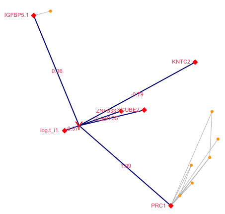

This is supplementary material to the  paper *"A Scalable Empirical Bayes Approach to Variable Selection in Generalized Linear Models"* (Bar, Booth & Wells, 2019).
This vignette provides code and sample output for some simulated data and case studies.

## Set-Up

SEMMS is implemented in R and is available as a package from the following web-site:
https://haim-bar.uconn.edu/software/ 

It requires R version 3.4.4 and up. It requires four packages to be pre-installed: Rcpp, RcppArmadillo, MASS, and car.
To install SEMMS, download the latest version (currently SEMMS_0.1.5.tar.gz) and in the R console navigate to the directory where the file is saved, and run:

```
install.packages("SEMMS_0.1.5.tar.gz", repos=NULL)
```

To create files which SEMMS can use, please read the documentation of the function readInputFile.

## The Ozone data

The air-pollution data set analyzed in this case study was first introduced in 
(Breiman, L, and J Friedman, 1985), who illustrated the ACE procedure. It consists of daily measurements of ozone concentration levels in the Los Angeles basin, collected over 330 days in 1976.  There are eight meteorological explanatory variables, labeled x1,...,x8:
 
  - x1: (vh) Vandenburg height, % - the altitude at which the pressure is 500 millibars,
  - x2: (wind) the wind speed (mph),
  - x3: (hum) the humidity (%),
  - x4: (temp) the temperature (Fahrenheit),
  - x5: (ibh) the temperature inversion base height (feet),
  - x6: (dpg) the pressure gradient (mm Hg),
  - x7: (ibt) the inversion base temperature (Fahrenheit),
  - x8: (vis) the visibility (miles).
  
We refer to a more recent analysis in (Lee, Nelder, and Pawitan, 2006, subsection 2.4.4), which also uses x9, the day of the year (doy). Selecting a first-order linear regression model can be done easily by checking all 2<SUP>9</SUP>=512 possible models, but this strategy is not feasible when we wish to include second, or third order terms (with 2<SUP>54</SUP> and 2<SUP>219</SUP> possible models, respectively.) We consider models with first and second order terms, with a total of 54 putative predictors.  We standardize these predictors using the scale function in R.
We use SEMMS to fit a log-linear model in which it is assumed that log(Y) is normally distributed. The following code shows how to run the “greedy” version of SEMMS (**rnd=F** in the code below), and produce some plots (see Figure 1 and Figure 2 below).

```
library(SEMMS)
# The ozone data, adding second order terms
fn <- system.file("extdata", "ozone.txt", package = "SEMMS", mustWork = TRUE)
dataYXZ <- readInputFile(fn, ycol=2, skip=19, Zcols=3:11,
   addIntercept = TRUE, logTransform = 2, twoWay = TRUE)fn <- "ozone.dat"
nn <- 20    # initial guess for the number of non-nulls
distribution <- "gaussian"
rnd <- F
fittedSEMMS <- fitSEMMS(dataYXZ, mincor=0.75, nn=nn, minchange=1,
                        distribution="N",verbose=T,rnd=rnd)
foundSEMMS <- sort(union(which(fittedSEMMS$gam.out$lockedOut != 0),
                         fittedSEMMS$gam.out$nn))
fittedGLM <- runLinearModel(dataYXZ,fittedSEMMS$gam.out$nn, "N")
print(summary(fittedGLM$mod))
plotMDS(dataYXZ, fittedSEMMS, fittedGLM, ttl="Ozone Data")
plotFit(fittedGLM)
```

Notes about the code:

1. In the readInputFile we used the option **twoWay=TRUE** to add all the second order terms.
2. **foundSEMMS** is a vector which contains all the selected variables and ones which are highly correlated with them (|r|>0.75 in this example.) 
3. **plotMDS** was used to generate a graphical representation of the selected variables and the response as a network in Figure 1, and **plotFit** was used to generate the diagnostics plots in Figure 2.
4. We get similar results if we do not log-transform the response, and use P (Poisson) instead of N (normal) in the distribution argument of **fitSEMMS**.
5. Note that **addIntercept = TRUE** means that the original data does not contain an intercept, so SEMMS should add it before running the algorithm. FALSE means that the data already contains an intercept, and there is no need to add it.
6. We used the option **nn=20** to start the algorithm with 20 putative predictors. SEMMS uses a simple criterion based on one predictor at a time analysis but, the user may provide a specific set of predictors for the initial iteration.  For example, to use variables 9, 45, and 54 we can use the **nnset** parameter, as follows:
    
```
fittedSEMMS <- fitSEMMS(dataYXZ, mincor=0.75, nnset=c(9,45,54), minchange=1,
                        distribution="N",verbose=T,rnd=rnd)
```
 


{ width=50% }


{ width=80% }

The log(ozone) levels are a quadratic function of the day of the year. The maximum of this second degree polynomial with respect to doy corresponds approximately to June 20, very close to the spring solstice. This captures the seasonal effect, as it is well known that ozone levels are associated with the duration of daylight.
The model with these variables fits well as can be seen in Figure 2, and it explains 83.3% of the variability in the data. The adjusted R<SUP>2</SUP> is 82.5, and the AIC is 187 (Aikake, 1974), compared with 75% and 303, respectively, in (Lee et al., 2006)

## The NKI70 data

The NKI70 data is available from the “penalized” package in R (Goeman, 2010). In (Bar, Booth, and Wells, 2019) we discuss how we used this data set to analyze which genes are associated with either death or recurrence of metastasis. Here, we show how to invoke SEMMS to perform the analysis, using the Poisson response, per (Whitehead, 1980).
The selected model is shown graphically in Figure 3.

```
fn <- system.file("extdata", "NKI70_t1.RData", package = "SEMMS", mustWork = TRUE)
dataYXZ <- readInputFile(file=fn, ycol=1, Zcols=2:73)
fittedSEMMS <- fitSEMMS(dataYXZ, mincor=0.8, nn=6, minchange  = 1,
                        distribution="P", verbose=T, rnd=F)
# Fit the linear model using the selected predictors
fittedGLM <- runLinearModel(dataYXZ,fittedSEMMS$gam.out$nn, "P")
plotMDS(dataYXZ, fittedSEMMS, fittedGLM, ttl="NKI70")

summary(fittedGLM$mod)
```

{ width=50% }

The estimated coefficients for the selected model are as follows:

```
Coefficients:
            Estimate Std. Error z value Pr(>|z|)    
(Intercept) -2.80923    0.39912  -7.039 1.94e-12 ***
Z0001       -0.36746    0.08802  -4.175 2.99e-05 ***
Z0017       -0.34947    0.27479  -1.272  0.20345    
Z0027       -0.78822    0.32698  -2.411  0.01593 *  
Z0035       -0.56106    0.35955  -1.560  0.11865    
Z0062        0.35915    0.16347   2.197  0.02801 *  
Z0066        1.09086    0.37508   2.908  0.00363 ** 
```

SEMMS allows the user to 'lock-in' variables. That is, to choose which variables *must*
be included in the model. For example, if we want to include log.t_i1. and Age in the model,
we invoke SEMMS by using the **Xcols** and **Zcols** paramaters, like this:

```
dataYXZ <- readInputFile(file=fn, ycol=1, Xcols=2:3, Zcols=4:73)
fittedSEMMS <- fitSEMMS(dataYXZ, mincor=0.8, nn=6, minchange  = 1,
                        distribution="P", verbose=T, rnd=F)
```


## Simulated Data – AR(1)

The following example consists of 1,000 predictors, of which 20 are significant and are highly correlated. The model was denoted by N5 in (Bar, Booth, and Wells, 2019).
 where the error terms are i.i.d. from a standard normal distribution, and Z1,...,Z20 are drawn from a multivariate normal distribution with an autoregressive (AR1) structure, with $\rho=0.95$. In this simulation, N=100 and in our simulations we show that the median number of true positives obtained by SEMMS is 20, and the median number of false positives is 0.
The code for fitting the mixture model to this data via SEMMS is given here. Note that the input file may be a text file (e.g., comma or tab separated) or it can be an RData file which was created previously with the readInputFile function.

```
fn <- system.file("extdata", "AR1SIM.RData", package = "SEMMS", mustWork = TRUE)
dataYXZ <- readInputFile(fn, ycol=1, Zcols=2:1001)
fittedSEMMS <- fitSEMMS(dataYXZ, mincor=0.8, nn=15, minchange  = 1,
                        distribution="N",verbose=T,rnd=F)
# Fit the linear model using the selected predictors
fittedGLM <- runLinearModel(dataYXZ,fittedSEMMS$gam.out$nn, "N")
plotMDS(dataYXZ, fittedSEMMS, fittedGLM, ttl="AR1 simulation")
```

In this data set SEMMS finds one false positive (v211) and 20 true positives. Figure 4 shows a graphical representation of the selected model. The red diamonds represent the variables which were selected by SEMMS, and the gold circles correspond to variables which are highly correlated with a selected predictor. This diagram, obtained from the plotMDS function in the SEMMS package clearly shows the AR(1) structure among the significant predictors.


{ width=50% }


## Simulated Data – Binary Response AR(1)

The data set SimBin provided with the package contains a simulated dataset
according to simulation B2 in (Bar, Booth, and Wells, 2019), with 1000 predictors
of which 10 are associated with a *binary* response. 
The true predictors consist of two set of variables (Z1-Z5 and Z101-Z105), each one having 
an autoregressive structure, AR(1), with rho=0.95.

```
fn <- system.file("extdata", "SimBin.RData", package = "SEMMS", mustWork = TRUE)
dataYXZ <- readInputFile(fn, ycol=1, Zcols=2:1001)
fittedSEMMS <- fitSEMMS(dataYXZ, mincor=0.7, nn=5, minchange  = 1,
    distribution="B", verbose=T, rnd=F)
fittedGLM <- runLinearModel(dataYXZ,fittedSEMMS$gam.out$nn, "B")
plotMDS(dataYXZ, fittedSEMMS, fittedGLM, ttl="Simulated Binomial (AR1)")
```

## References

Akaike, Hirotugu. 1974. "A new look at the statistical model identification." IEEE Transactions on Automatic Control 19 (6): 716-723.

Bar, Haim, James G. Booth, and Martin T. Wells (2019), Journal of Computational and Graphical Statistics, DOI: 10.1080/10618600.2019.1706542

Breiman, L, and J Friedman. 1985. "Estimating Optimal Transformations for Multiple Regression and Correlation." Technometrics 80: 580-598.

Goeman, J J. 2010. "L1 penalized estimation in the Cox proportional hazards model." no. 1. 14.
Hastie, T, and R Tibshirani. 1990. Generalized Additive Models. New York, NY, USA: Chapman and Hall.

Lee, Y, J A Nelder, and Y Pawitan. 2006. Generalized Linear Models with Random Effects. London, UK: Chapman & Hall/CRC.

Whitehead, J. 1980. "Fitting Cox’s Regression Model to Survival Data Using GLIM." Applied Statistics 29: 268-275.


<!--
## Appendix

Changes from version 0.1.0 to 0.1.1 (June 30, 2019)
    1. The response and the predictors are now scaled automatically. This makes the interpretation of the mixture models parameters easier. It also solved an initialization error.
    2. Added a warning message when, during the initialization, no predictors are selected after the Benjamini-Hochberg adjustment to the p-values. SEMMS continues when this happens because, as we found in simulations, SEMMS is more powerful than “one predictor at a time” methods.
    3. It is no longer necessary to install the smacof package. SEMMS now contains an implementation of the multi-dimensional scaling algorithm.
    4. A previous version of this document showed how to output the plots and results to a Microsoft Word or PowerPoint documents, using the ReporteRs package, which has since been replaced with another package, but the option to create editable plots. On a Windows machine it is possible to create editable plots with the win.metafile function.
    -->
